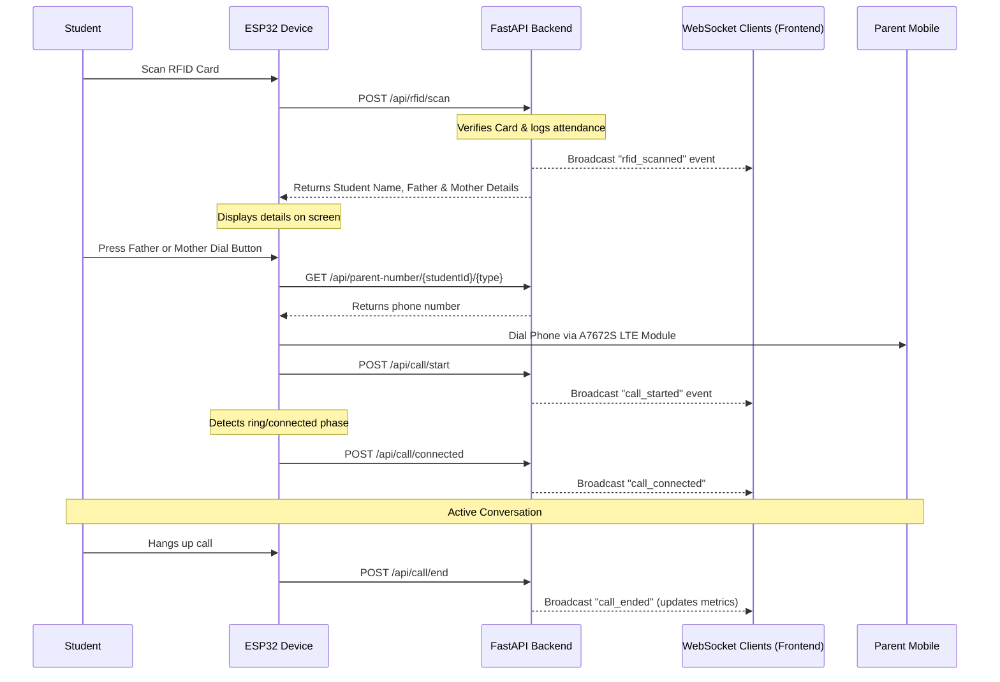

# Smart Parent Calling System (SPCS)

The **Smart Parent Calling System (SPCS)** is a complete, production-ready, and highly secure IoT web platform. It enables students to scan their RFID cards on an ESP32 hardware device, automatically maps their profiles to parent contact details, and commands an A7672S LTE module connected to the ESP32 to dial the selected parent (Father or Mother) in real time.

---

## 🚀 Key Features

* **Apple-level Responsive Dashboard**: Real-time stats display, including Total Students, Active Scans, Call logs counts, and Online/Offline diagnostics.
* **Live WebSocket Feeds**: Instantly pushes incoming card scan details, phone dial statuses, and heartbeat states to connected admin panels.
* **Full calling flow integration**: Implements the exact ESP32 request flow: scan -> student check -> select parent -> get mobile number -> start dial -> connect -> hang up.
* **Excel Utilities**: Excel bulk template imports for registers and complete roster Excel exports.
* **Role-Based Access Control (RBAC)**: Supports logins and session states for Super Admins, School Admins, and Teachers.
* **Hardware Diagnostics**: Real-time ESP32 ping rates, battery percentages, WiFi signal strength (RSSI), and SIM carrier detection.
* **Audit Trails & Security**: Complete user action logs and secure JWT encryption.

---

## 🛠️ System Architecture & Data Flow



---

## 📂 Project Structure

```
├── backend/                  # FastAPI Python Backend
│   ├── app/
│   │   ├── main.py           # REST APIs & WebSocket entry point
│   │   ├── core/             # JWT configurations, security, databases
│   │   ├── models/           # SQLAlchemy DB declarations
│   │   ├── schemas/          # Pydantic request/response validation schemas
│   │   ├── api/              # Module endpoints (Auth, Students, RFID, Call, Devices)
│   │   ├── crud/             # Database CRUD functions
│   │   └── seed.py           # DB bootstrapper script
│   ├── mock_esp32.py         # ESP32 hardware workflow simulator
│   ├── requirements.txt      # Python dependencies
│   ├── .env                  # Backend environment file
│   └── Dockerfile            # Container configuration
└── frontend/                 # Vite + React + TS Frontend
    ├── src/
    │   ├── App.tsx           # Router and views layout
    │   ├── context/          # State managers (Auth, WebSocket, Toast)
    │   ├── components/       # Sidebars, StatCards, Timelines
    │   └── pages/            # Admin panel pages (Dashboard, Roster, Devices, History)
    ├── package.json          # Node dependencies
    ├── tailwind.config.js    # Tailwind layout configurations
    └── vite.config.ts        # Reverse proxy and assets server
```

---

## ⚡ Quickstart Setup

### 1. Backend Setup
1. Open a terminal in the `backend` folder:
   ```bash
   cd backend
   ```
2. Create and activate a Python virtual environment:
   ```bash
   python -m venv venv
   # On Windows:
   .\venv\Scripts\activate
   # On Mac/Linux:
   source venv/bin/activate
   ```
3. Install dependencies:
   ```bash
   pip install -r requirements.txt
   ```
4. Copy `.env.example` to `.env`:
   ```bash
   copy .env.example .env
   ```
5. Seed initial mock database values (devices, students, call statistics):
   ```bash
   python app/seed.py
   ```
6. Run the FastAPI development server:
   ```bash
   uvicorn app.main:app --reload --host 0.0.0.0 --port 8000
   ```
   * *Swagger API docs will be live at: [http://localhost:8000/docs](http://localhost:8000/docs)*

---

### 2. Frontend Setup
1. Open a separate terminal in the `frontend` folder:
   ```bash
   cd frontend
   ```
2. Run installation and launch:
   ```bash
   npm install
   npm run dev
   ```
3. Open your browser and navigate to: `http://localhost:5173`
   * *Login with default credentials: `admin@spcs.com` / `Admin@123`*

---

## ⚙️ ESP32 Hardware Wiring Reference (A7672S LTE)

Below is the pin wiring reference to hook up the ESP32 to the RFID scanner and the A7672S LTE communication modem:

* **MFRC522 RFID Card Reader**:
  * `SDA (SS)` ➡️ ESP32 `GPIO 21`
  * `SCK` ➡️ ESP32 `GPIO 18`
  * `MOSI` ➡️ ESP32 `GPIO 23`
  * `MISO` ➡️ ESP32 `GPIO 19`
  * `RST` ➡️ ESP32 `GPIO 22`
  * `GND` ➡️ ESP32 `GND`
  * `3.3V` ➡️ ESP32 `3.3V`

* **A7672S LTE Modem**:
  * `TX` ➡️ ESP32 `GPIO 16` (RX2)
  * `RX` ➡️ ESP32 `GPIO 17` (TX2)
  * `GND` ➡️ Common `GND`
  * `VCC` ➡️ External `5V/2A` power source (high current required during dialing burst)

---

## 🧪 Verification & Testing

* **Running Backend Unit Tests**:
  Ensure you are inside the `backend` folder and run:
  ```bash
  pytest app/tests
  ```

* **Simulating ESP32 Hardware Client**:
  To verify the database mapping and WebSocket push alerts without actual hardware connected, run the Python simulation script:
  ```bash
  python mock_esp32.py
  ```
  *(This scans a random card, checks student details, fetches the father's mobile number, and logs call initiation -> connection -> call completion phases in real-time.)*
